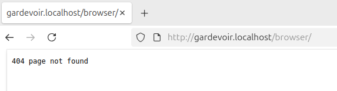
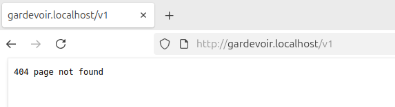
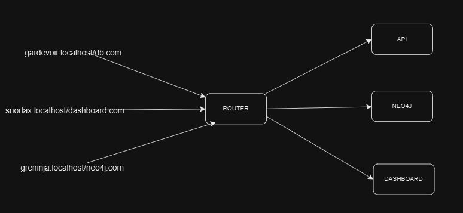
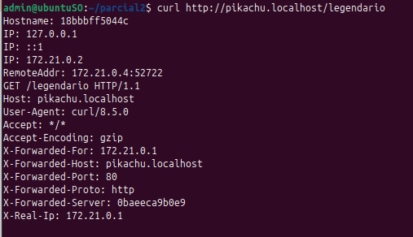
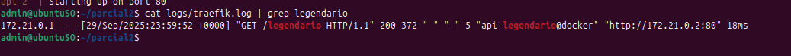
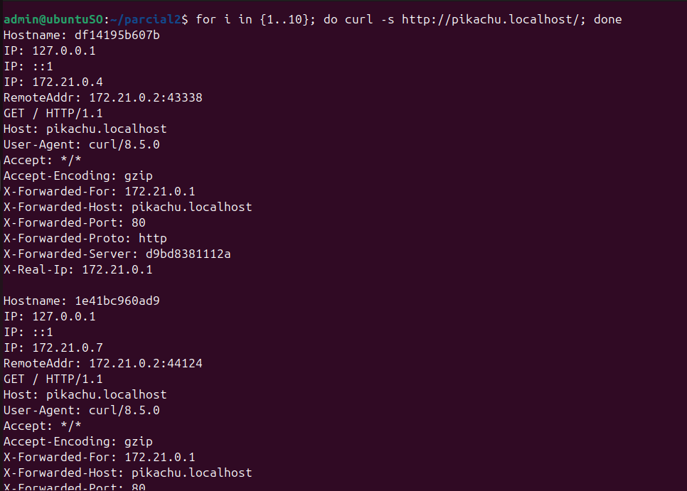
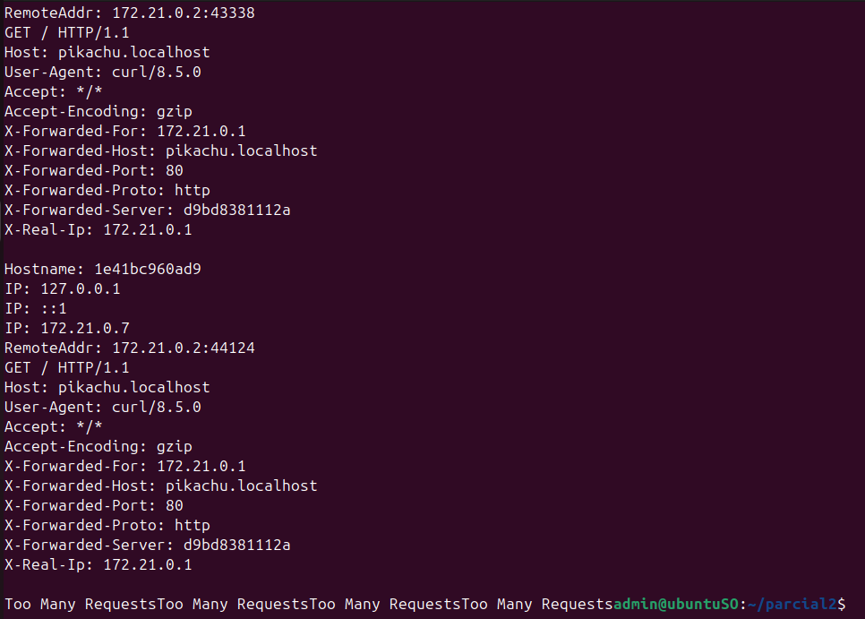

# Solución Parcial #2

## Autores:

Cristian Javier Gómez Pérez , Código: 202310427

Edwar Julian Cabra Coy , Código: 202312577 

## Punto 1:

- Evidencias: Se logra observar que cada url se accede por medio de los criterios solicitados, mas sin embargo no es posible acceder a ellas (error 404) debido a un error relacionado con los hosts, la ultima imagen contiene el diagrama de cada url.

## Punto 2:

- Evidencias: En la primera imagen se evidencia el balanceo de cargas en el endpoint normal de la api, donde se puede ver mediante las ips registradas, en la segunda imagen se evidencia en los logs del endpoint legendario solo tiene una replica.

## Punto 3:

- Evidencias: Las primeras dos imagenes muestran la verificacion del middleware rateLimit, que muestra un error luego de sobrepasar el limite de peticiones, la tercera imagen muestra el acceso denegado sin credenciales (authBasic), aunque se cuenta con el mismo error del primer punto.

- Analogias: El acceso por medio de una autenticacion basica equivale al control de pasaporte en la puerta de embarque, donde solo los pasajeros con documento válido (usuario y contraseña) pueden acceder a la terminal, por otro lado el middleware rateLimit funciona como los torniquetes de seguridad que regulan el flujo de pasajeros, ya que aunque todos tengan acceso, solo un número limitado puede pasar en un intervalo de tiempo para evitar congestión, por ultimo, el pathPrefix es como señalizar que cierta puerta solo atiende vuelos con un destino específico, los pasajeros deben presentar su pase de abordar en la fila correcta para poder pasar, de lo contrario, se les niega el acceso.